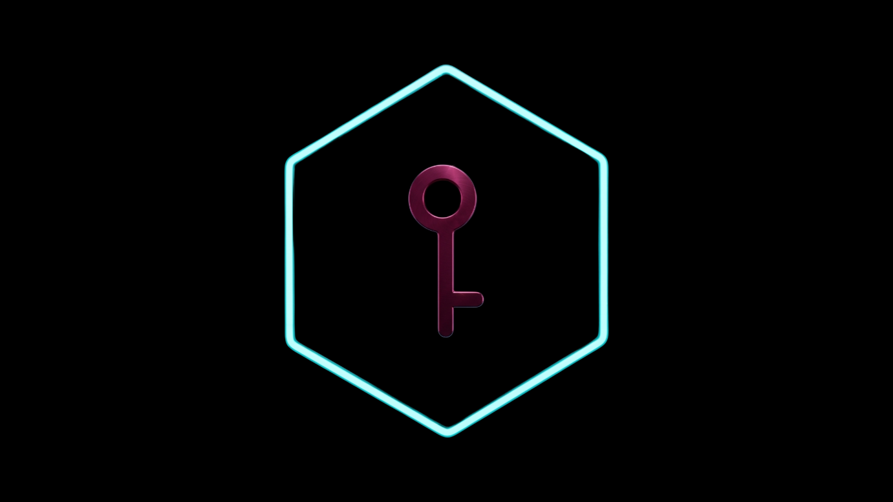
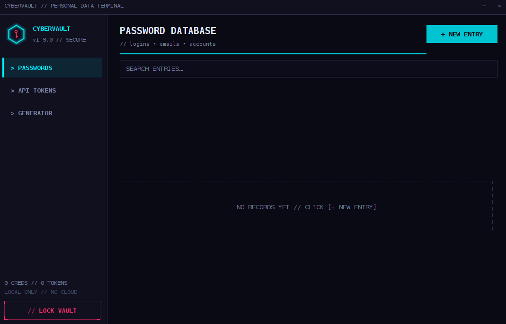
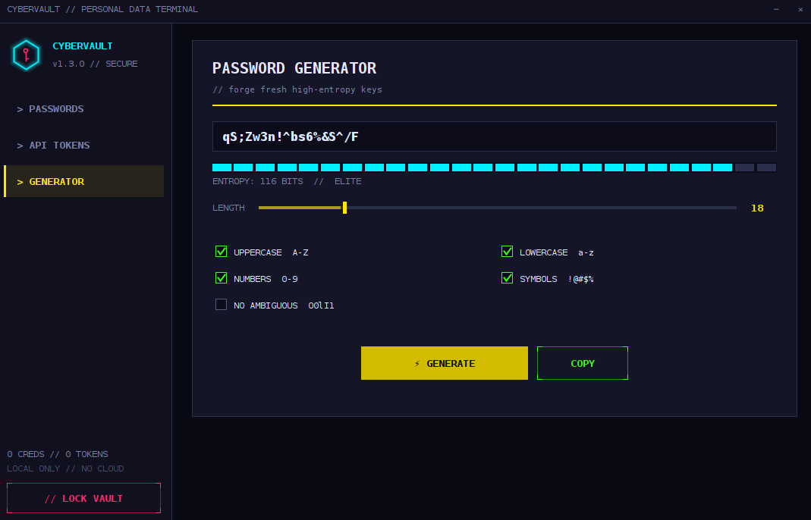
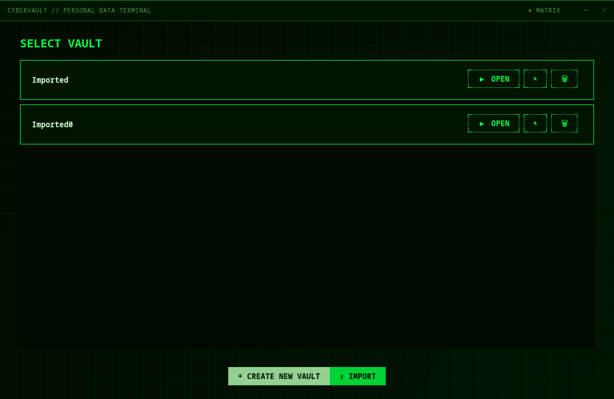
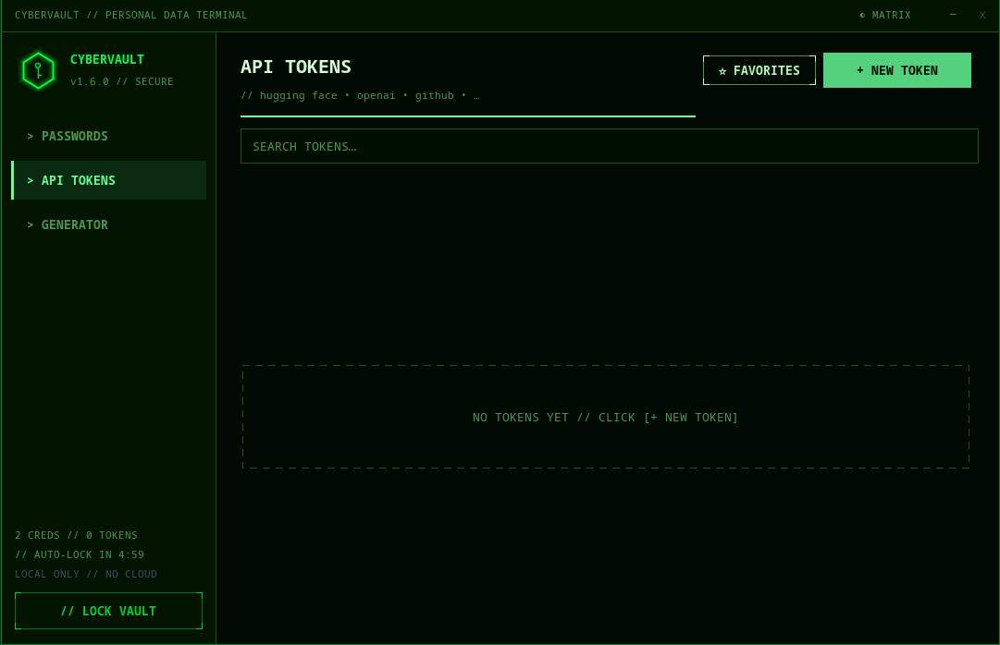
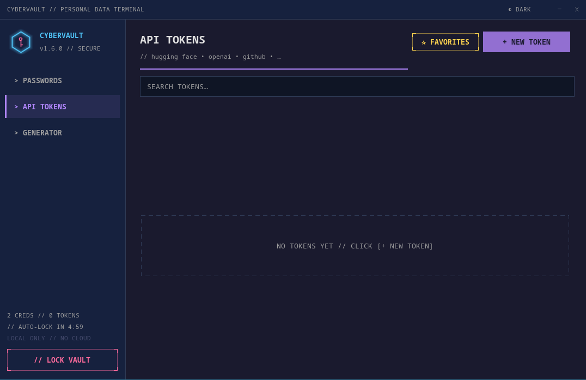
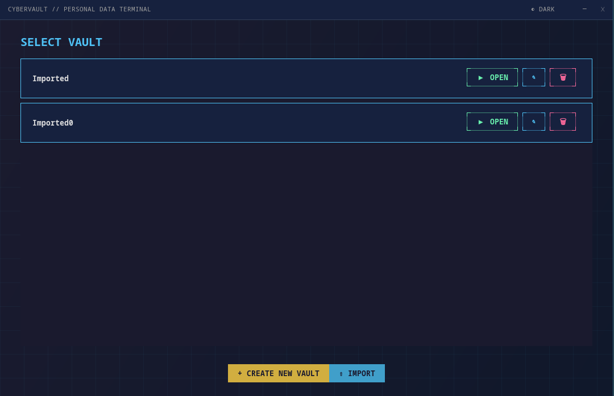
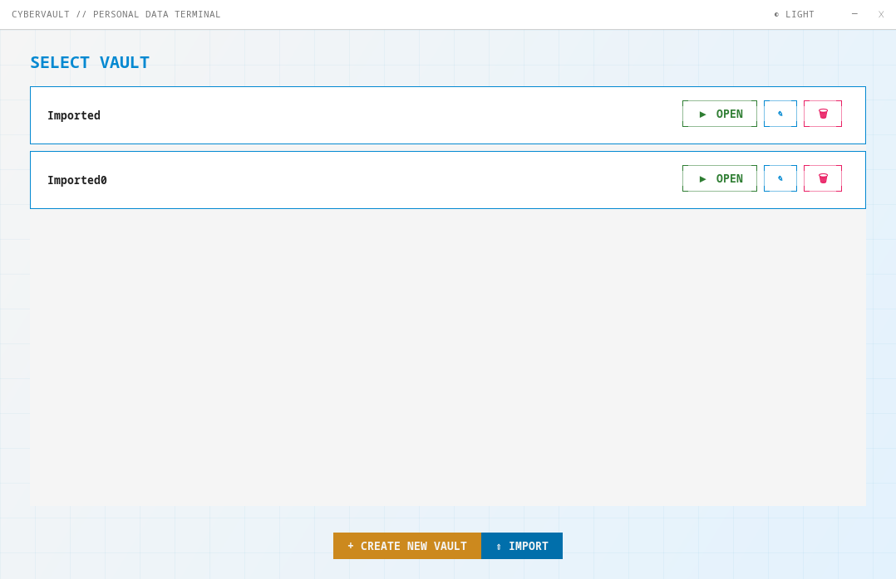
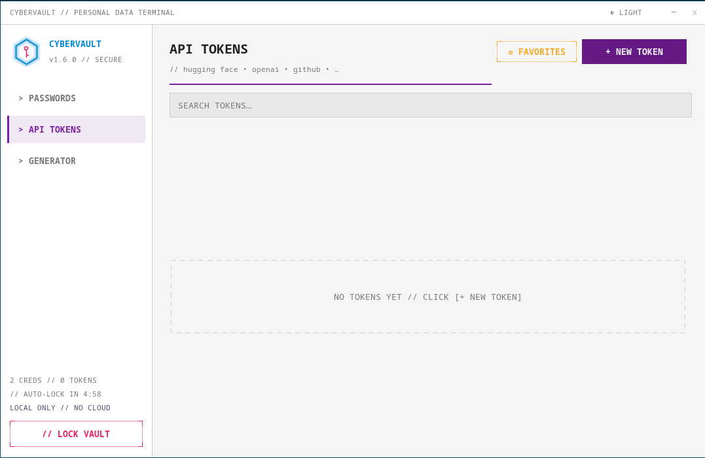

<h1 align="center">CYBERVAULT</h1>

<p align="center"></p>

<p align="center">
  A cyberpunk-styled, fully offline password manager &amp; API token vault.<br>
  Pure Java Swing. Zero dependencies. AES-256-GCM encrypted.
</p>

<p align="center">
  
  
  
  
  
  
</p>


## ✨ Features

### 🔒 Security First
- 🔐 **Master-key vault** — PBKDF2 (120k iterations) + AES-256-GCM authenticated encryption
- ⏰ **Auto-Lock** — vault locks automatically after 5 minutes of idle time (live countdown in sidebar)
- 🔒 **Lock vault** — wipes keys & decrypted data from RAM
- 📋 **One-click copy** — clipboard auto-clears after 20 s
- 💾 **100% offline** — data lives only in `~/.cybervault/`, never touches the network

### 📦 Multi-Vault Architecture
- 🗂️ **Unlimited isolated vaults** — separate keys for personal, work, and crypto credentials
- 🏷️ **Rename, delete & import** vaults on the fly
- 👁️ **Per-vault master keys** — each vault has its own encryption

### 📝 Organization
- 👤 **Password entries** — title, username / email, password, URL, notes & tags
- 🤖 **API token vault** — keep Hugging Face, OpenAI, GitHub… tokens safe
- 🏷️ **Tags & Categories** — comma-separated tags, clickable `#tag` chips, filter bar, tag search
- ⭐ **Favorites** — star any entry to pin it, filter starred entries with one click
- 🔎 **Live search** — across titles, usernames, URLs, notes **and tags**
- 👁 **Show / hide** secrets with one click

### 🎨 Themes
- 🌃 **Cyberpunk** — the classic neon cyan & pink look
- 🟢 **Matrix** — green palette with animated **digital rain** background
- 🌙 **Dark** — calm low-light theme for night sessions
- ☀️ **Light** — clean bright theme for daylight use
- ◐ **Live theme switcher**

### ⚡ Power Tools
- ⚡ **Password generator** — 8–64 chars, custom pools, no-ambiguous mode, live entropy meter
- 🌃 **Neon cyberpunk UI** — custom-painted buttons, slider, scrollbars & hex logo
- 🖥️ **Cross-platform** — works on Linux, macOS & Windows (JDK 8+)

# 🖼 More screenshots

<p align="center"></p>
<p align="center"></p>

## Matrix
<p align="center"></p>
<p align="center"></p>

# Dark
<p align="center"></p>
<p align="center"></p>

# Light
<p align="center"></p>
<p align="center"></p>


## Requirements
- JDK 8+

<br>
<br>

## 🚀 Quick start

```bash
./build.sh                 # or build.bat on Windows
java -jar CyberVault.jar
```

**First run:** create a master key (min 6 chars) → it is **never stored and cannot be recovered** → start adding entries.

<br>
<br>

## 🔐 Security model

```
master key ──PBKDF2-HMAC-SHA256 (120 000 iters, 16 B salt)──▶ AES-256 key
vault data ──serialize──▶ AES/GCM/NoPadding (12 B IV, 128-bit tag) ──▶ vault.dat
```

File format:

```
[ salt · 16 B ][ IV · 12 B ][ ciphertext + auth tag ]
```

- Wrong master key **or** a single tampered bit → decryption fails (GCM authentication).
- Passwords are handled as `char[]` and zeroed in memory after use.
- **Lock** clears key, salt and decrypted data from RAM.
- Clipboard is cleared 20 s after copying (only if unchanged).
- Auto-Lock triggers after 5 minutes of inactivity (configurable in code).

> ⚠️ This is a personal project. Use it at your own risk and **don't forget your master key**.

## 🖥 Desktop Integration (Linux)

Create `~/.local/share/applications/cybervault.desktop`:

```ini
[Desktop Entry]
Name=CyberVault
Comment=Cyberpunk password manager
Exec=java -jar /home/USER/path/to/CyberVault.jar
Icon=/home/USER/path/to/assets/icon.png
Terminal=false
Type=Application
Categories=Utility;Security;
```

Then run:

```bash
chmod +x ~/.local/share/applications/cybervault.desktop
update-desktop-database ~/.local/share/applications
```

Now CyberVault is available in the app menu (Super key) — launch it once,
then right-click its icon and **Add to Favorites** to pin it to your dock.


<br>
<br>

## 🤖 AI Assistance

This project was built with an AI pair programmer ([Qwen](https://qwen.ai)).
Every line of code was reviewed, understood and tested by me before shipping —
the AI accelerated the process, but the decisions (and the bugs) are mine.

> Transparency matters: you deserve to know how the software you trust is made.

<br>
<br>

## 🧾 License

MIT — see [LICENSE](LICENSE).

---

<br>
<br>
<p align="center">Made with ⚡, pure Java Swing & an AI pair programmer</p>
<p align="center">May The Force Be With You</p>
