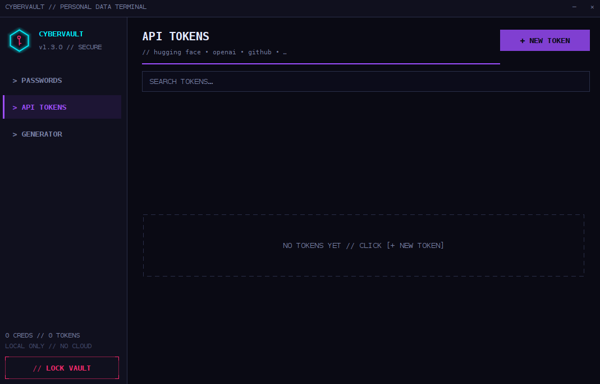
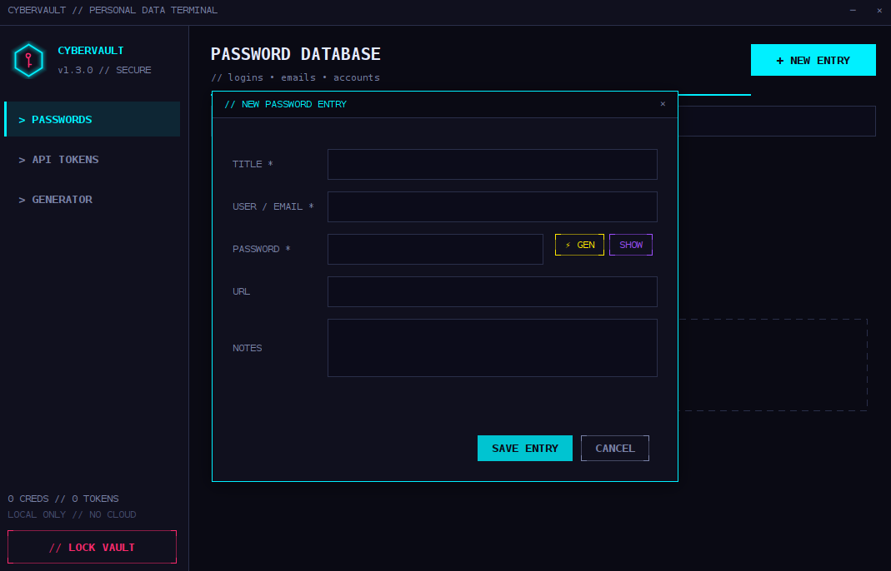

# ⚡ CyberVault

A cyberpunk-styled, fully offline password manager & API token vault built with pure Java Swing. Zero dependencies.

<p align="center"></p>
<p align="center"></p>
<p align="center"></p>
<p align="center"></p>

## Features
- 🔐 Master-key protected vault — PBKDF2 (120k) + AES-256-GCM
- 👤 Password entries: title, **username / email**, password, URL, notes
- 🤖 API Tokens section (Hugging Face, OpenAI, GitHub, ...)
- ⚡ Built-in password generator with entropy meter
- 🔎 Live search, show/hide, one-click copy (clipboard auto-clears)
- 🌃 Dark neon cyberpunk UI

## Requirements
- JDK 8+

## Build
```bash
./build.sh        # Linux / macOS
build.bat         # Windows
```

# Run
java -jar CyberVault.jar

# Security
- Vault file: ~/.cybervault/vault.dat (encrypted)
- The master key is never stored and cannot be recovered.
